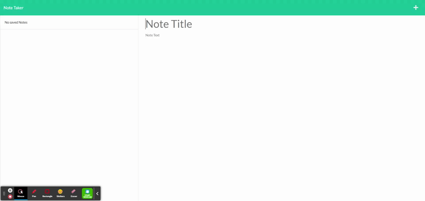

# Note-Taker

Note-Taker is a app designed to save delete and write notes

## Installation

clone repository and in terminal run NPM Install, then type NPM start in terminal, you should get a reply app listening on port 3000. From there navigate to localhost:3000 in your browser and the app will be running. 

## Usage
After you have installed the appropriate node modules you should see the app is running. Now we can get into the note taker application. You can type a title on your first line. The line below will be the actual notes. you may type your notes there. Click the floppy disk icon on the top right next to the + icon. that will save your notes. the plus icon will be to start a new note. On the left column you can see your saved notes. There is also a delete icon there to remove any notes you do not wish to keep. You may click the titles of your notes to see any notes you saved.


## Terminal notifications you should see while running the app
```bash

Notes saved
Notes deleted
Notes posted
```

## video



